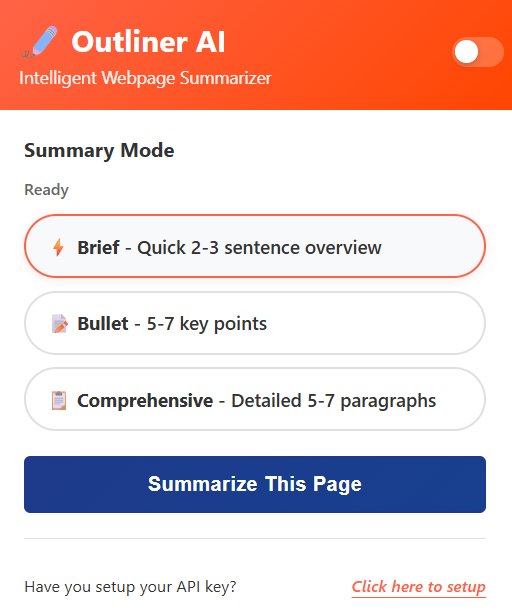

# 📝 Outliner - AI-Powered Web Content Summarizer

<div align="center">


**Transform lengthy articles into concise summaries with AI-powered intelligence**

[](https://chrome.google.com/webstore)
[](https://github.com/Sujal2308/outliner-extension/stargazers)
[](LICENSE)
[](https://github.com/Sujal2308/outliner-extension/releases)

[🚀 Install Extension](https://chrome.google.com/webstore) • [📖 Documentation](#documentation) • [🐛 Report Bug](https://github.com/Sujal2308/outliner-extension/issues) • [✨ Request Feature](https://github.com/Sujal2308/outliner-extension/issues)

</div>

---

## 🌟 Overview

Outliner is a powerful Chrome extension that leverages Google's Gemini AI to instantly summarize any webpage content. Whether you're researching, studying, or just trying to stay informed, Outliner saves you time by condensing lengthy articles into digestible summaries.

### ✨ Key Features

- **🤖 AI-Powered Summarization** - Powered by Google Gemini AI for accurate, context-aware summaries
- **📊 3 Summary Modes** - Brief, Bullet Points, and Comprehensive to match your reading style
- **⚡ Lightning Fast** - Get summaries in seconds, not minutes
- **🔒 Privacy First** - Your data stays secure with local processing
- **🆓 100% Free** - No subscriptions, no hidden costs
- **🎨 Beautiful UI** - Clean, modern interface that's easy on the eyes
- **📱 Responsive Design** - Works seamlessly across all screen sizes
- **🌐 Universal Compatibility** - Works on any website, any article

---

## 🚀 Quick Start

### Installation

1. **Download from Chrome Web Store**

   ```
   Visit: https://chrome.google.com/webstore
   Search: "Outliner - AI Web Summarizer"
   Click: "Add to Chrome"
   ```

2. **Setup Gemini API Key**
   - Get your free API key from [Google AI Studio](https://aistudio.google.com/)
   - Open the extension popup
   - Paste your API key in settings
   - You're ready to go!

### Usage

1. **Navigate to any webpage** with content you want to summarize
2. **Click the Outliner icon** in your Chrome toolbar
3. **Choose your summary mode:**
   - 📝 **Brief** - Quick overview in a few sentences
   - 🔸 **Bullet Points** - Key points in an organized list
   - 📄 **Comprehensive** - Detailed analysis with context
4. **Click "Summarize"** and get your AI-generated summary instantly!

---

## 🎯 Summary Modes

### 📝 Brief Mode

Perfect for quick overviews when you're in a hurry. Get the essence of any article in 2-3 sentences.

### 🔸 Bullet Points Mode

Ideal for studying and note-taking. Key information organized in easy-to-scan bullet points.

### 📄 Comprehensive Mode

Best for research and deep understanding. Detailed summaries that capture nuances and context.

---

## 📸 Screenshots

<div align="center">

### Extension Interface



### Summary Styles


### How It Works Process


</div>

---

## 🛠️ Technical Details

### Built With

- **Frontend**: React 18 + Vite
- **Styling**: Tailwind CSS
- **AI Engine**: Google Gemini API
- **Architecture**: Chrome Extension Manifest V3
- **Icons**: Custom SVG icons
- **Fonts**: Bungee, Jost, Inter

### Project Structure

```
outliner-extension/
├── chrome-extension-package/     # Chrome extension files
│   ├── manifest.json            # Extension manifest
│   ├── background/               # Background scripts
│   ├── content/                  # Content scripts
│   ├── popup/                    # Extension popup UI
│   └── utils/                    # Utility functions
├── src/                          # Landing page source
│   ├── components/               # React components
│   ├── assets/                   # Static assets
│   └── lib/                      # Utility libraries
├── public/                       # Public assets
└── Outliner-landing page/        # Landing page build
```

### Performance

- ⚡ **Fast Loading**: < 100ms startup time
- 🔋 **Low Memory**: < 10MB memory footprint
- 📡 **Efficient API**: Optimized API calls to minimize usage
- 🎨 **Smooth UI**: 60fps animations and transitions

---

## 🔧 Development

### Prerequisites

- Node.js 18+
- Chrome Browser
- Git

### Local Development

1. **Clone the repository**

   ```bash
   git clone https://github.com/Sujal2308/outliner-extension.git
   cd outliner-extension
   ```

2. **Install dependencies**

   ```bash
   npm install
   ```

3. **Start development server**

   ```bash
   npm run dev
   ```

4. **Load extension in Chrome**
   - Open Chrome and go to `chrome://extensions/`
   - Enable "Developer mode"
   - Click "Load unpacked"
   - Select the `chrome-extension-package` folder

### Building

```bash
# Build landing page
npm run build

# Build extension (if using build process)
npm run build:extension
```

### Testing

```bash
# Run tests
npm test

# Run linting
npm run lint

# Type checking
npm run type-check
```

---

## 📊 Browser Support

| Browser | Version | Status          |
| ------- | ------- | --------------- |
| Chrome  | 88+     | ✅ Full Support |
| Edge    | 88+     | ✅ Full Support |
| Brave   | 1.20+   | ✅ Full Support |
| Opera   | 74+     | ✅ Full Support |

---

## 🤝 Contributing

We welcome contributions! Here's how you can help:

### Ways to Contribute

- 🐛 **Report Bugs** - Found an issue? Let us know!
- 💡 **Suggest Features** - Have ideas? We'd love to hear them!
- 📝 **Improve Documentation** - Help make our docs better
- 🔧 **Submit Code** - Fix bugs or add features

### Development Workflow

1. **Fork the repository**
2. **Create a feature branch**
   ```bash
   git checkout -b feature/amazing-feature
   ```
3. **Make your changes**
4. **Commit with conventional commits**
   ```bash
   git commit -m "feat: add amazing new feature"
   ```
5. **Push to your branch**
   ```bash
   git push origin feature/amazing-feature
   ```
6. **Open a Pull Request**

### Code Style

- Use Prettier for formatting
- Follow ESLint rules
- Write meaningful commit messages
- Add tests for new features

---

## 📋 Roadmap

### 🚧 Current Sprint

- [ ] Add support for PDF summarization
- [ ] Implement dark/light theme toggle
- [ ] Add keyboard shortcuts
- [ ] Improve error handling

### 🎯 Upcoming Features

- [ ] Multi-language support
- [ ] Summary export options (PDF, TXT)
- [ ] Summary history and bookmarks
- [ ] Collaborative features
- [ ] Advanced AI models integration

### 🔮 Future Vision

- [ ] Mobile app companion
- [ ] Team/organization features
- [ ] Analytics dashboard
- [ ] Custom AI model training

---

## ❓ FAQ

<details>
<summary><strong>Is Outliner really free?</strong></summary>
Yes! Outliner is completely free to use. You only need a free Gemini API key from Google.
</details>

<details>
<summary><strong>How do I get a Gemini API key?</strong></summary>
Visit <a href="https://aistudio.google.com/">Google AI Studio</a>, sign in with your Google account, and generate a free API key.
</details>

<details>
<summary><strong>What types of content can Outliner summarize?</strong></summary>
Outliner works with articles, blog posts, research papers, news articles, documentation, and most text-based web content.
</details>

<details>
<summary><strong>Is my data secure?</strong></summary>
Yes! Your browsing data is processed locally and only the text you choose to summarize is sent to Google's API for processing.
</details>

<details>
<summary><strong>Can I use Outliner offline?</strong></summary>
Currently, Outliner requires an internet connection to communicate with the Gemini API. Offline functionality is planned for future releases.
</details>

---

## 📞 Support

### Get Help

- 📖 **Documentation** - Check our comprehensive guides
- 💬 **Discussions** - Join our [GitHub Discussions](https://github.com/Sujal2308/outliner-extension/discussions)
- 🐛 **Bug Reports** - Create an [issue](https://github.com/Sujal2308/outliner-extension/issues)
- 📧 **Email Support** - contact@outliner.dev

### Community

- 🐦 **Twitter** - [@OutlinerAI](https://twitter.com/OutlinerAI)
- 💬 **Discord** - [Join our server](https://discord.gg/outliner)
- 📰 **Blog** - [Latest updates](https://blog.outliner.dev)

---

## 📄 License

This project is licensed under the MIT License - see the [LICENSE](LICENSE) file for details.

---

## 🙏 Acknowledgments

### Special Thanks

- **Google AI** - For the powerful Gemini API
- **Chrome Team** - For the excellent extension platform
- **Open Source Community** - For the amazing tools and libraries
- **Beta Testers** - For their valuable feedback

### Built With Love

- ☕ Lots of coffee
- 🎵 Good music
- 💻 Late night coding sessions
- ❤️ Passion for productivity tools

---

<div align="center">

**Made with ❤️ by the Outliner team**

[⬆️ Back to top](#-outliner---ai-powered-web-content-summarizer)

</div>

---

## 📈 Stats

<div align="center">


</div>
